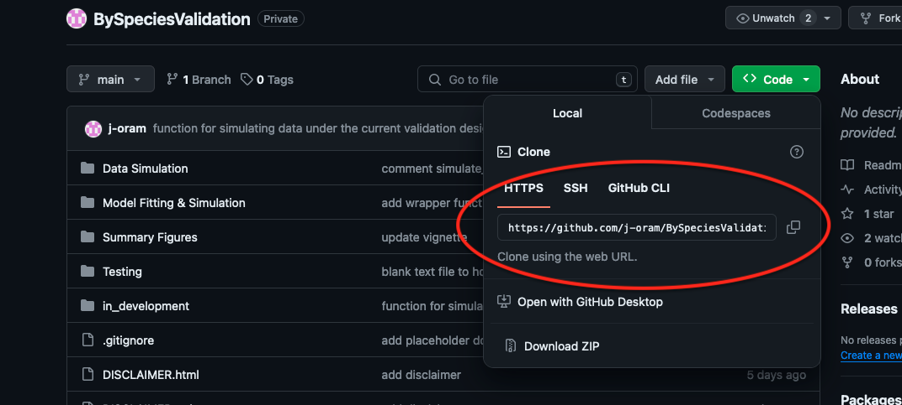
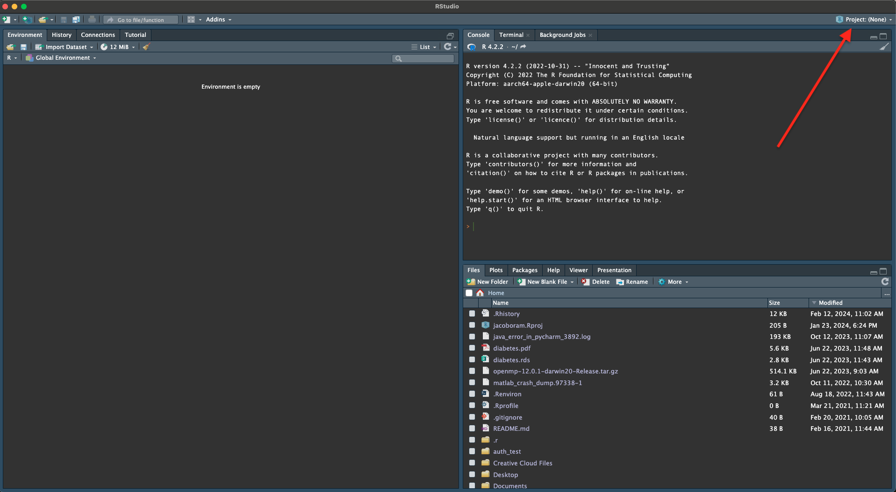

# BySpeciesValidation

This repository contains supplementary files to accompany the manuscript "Investigation into stratified-by-species validation of species labels for acoustic surveys". 

**Disclaimer:**  This information is preliminary and is subject to revision. It is being provided to meet the need for timely best science.
The information is provided on the condition that neither the U.S. Geological Survey nor the U.S. Government shall be
held liable for any damages resulting from the authorized or unauthorized use of the information.

## Getting started 

To get started with this repo, follow these steps: 

1. Clone the repo from GitHub. You can do this by following these substeps:
  - On GitHub, click on the green "Code" button and copy the repo URL.
  
  - Open RStudio on your computer then in the top right corner clicking on "Project: (None)"
  
  - Selecting New Project > Version Control > Git. 
  - Paste the repo URL.
  - Name the directory.
  - Set the location where you'd like to set the project as a subdirectory. 
  - Click "Create Project".

2. When cloning is complete, run `runall.R`, which conducts an entire small-scale simulation study. You can expect this to take approximately 2-3 minutes.
3. Knit `vignette.Rmd` and read this document to see how the code in this repo holds together.

To familiarize yourself with the contents of the repo, see the description of contents below.

## Contents 

- I THOUGHT WE DISCUSSED PACKAGING THIS UP AS AN R PACKAGE. ARE YOU PLANNING TO DO THAT? IF SETTING THIS UP AS AN R PACKAGE, REFER TO "R PACKAGES"" BOOK [https://r-pkgs.org/](https://r-pkgs.org/) TO RESTRUCTURE CODE AND DESCRIBE STRUCTURE ACCORDINGLY. YOU'LL NEED TO ADD DOCUMENTATION TO ALL FUNCTIONS IF MAKING AN R PACKAGE, SO SOME OF THE TEXT BELOW MAY BE ABLE TO GO IN THE DOCUMENTATION FOR THE FUNCTIONS. WE CAN DISCUSS THIS ON THURSDAY...SEE ALSO COMMENTS ON CURRENT STRUCTURE.

The files in this repo are organized into three primary folders: __Data Simulation__, __Model Fitting & Simulation__, and __Summary Figures__. Additional folders for testing and the vignette are currently in the repo also, but these will likely move when the package is reorganized to be an R package.

- Data Simulation: [IS THERE ONE OF THESE FUNCTIONS THAT JUST DOES EVERYTHING? PERHAPS PRESENT IN ORDER OF USE AND NEST DEPENDENT FUNCTIONS UNDER PARENT FUNCTIONS WITH SUB-BULLETS?  (E.G., SIMULATION_SCENARIOS.R FIRST, THEN SIMULATE_BYSPPVALIDATION.R WITH DEPENDENDT FUNCTIONS NESTED BENEATH IT)]
  - `simulate_validatedData.R`: This script defines a user-friendly wrapper function that simulates data under user-specified validation scenarios. Use this function to conduct your own simulations. For more information about the inputs/outputs of the function and an example of its usage, see the vignette in this repo.
  - `count_detection_sim.R`: This file simulates from the count detection model as described by Stratton et al., (2022). This is a dependency of `simulate_BySpeciesValidation`. 
  - `mask_by_spp.R`: Function to carry out the masking of true species labels according to a stratified-by-species validation design. Masking of a true species label corresponds with that file not being validated. Rows of the dataset that retain their true species label are the 'validated data' in simulations.
  - `mask_FE.R`: An identical function that carries out masking accoring to a fixed effort validation design. 
  - `summarize_n_validated.R`: A function for summarizing the number of recordings validated under each user-specified validation scenario.
  
- Model Fitting & Simulation: 
  - `run_sims.R`: This is the main file in this folder, and it is used for fitting the simulated data obtained by running `simulate_validatedData.R`.
  - `MCMC_sum.R`: Functions for summarizing MCMC output. 
  - `runMCMC_fit.R`: This file automates the NIMBLE workflow of defining inits functions, configuring and compiling models and MCMC and then running chains. Notice that by default, the number of chains is set to 1 because this is used to parallelize model fitting in `run_sims.R`. 
  - `tune_mcmc.R`: Script defining the tuning function that suggests possible warmup values and iterations to use in your simulation study. **Note that these outputs are only guidelines!** For large simulation studies, it may be wise to increase the number of iterations and warmup above the suggested values to ensure convergence. Doing so may avoid having to rerun simulations if models have not converged.
  
- Summary Figures:
  - `visualize_sims.R`: This script contains two wrapper functions that can visualize the simulation output from `run_sims.R`. See the pdf vignette for an example of how to use these.

- Testing: Directory containing output from `Testing.R`
- VIGNETTE: ONCE FINISHED SHOULD JUST BE THE PDF AS IT IS A STATIC DOC. SEE ALSO, R PACKAGES FOR MORE GUIDELINES/HOW TO STRUCTURE THIS WITHIN AN R PKG. 

