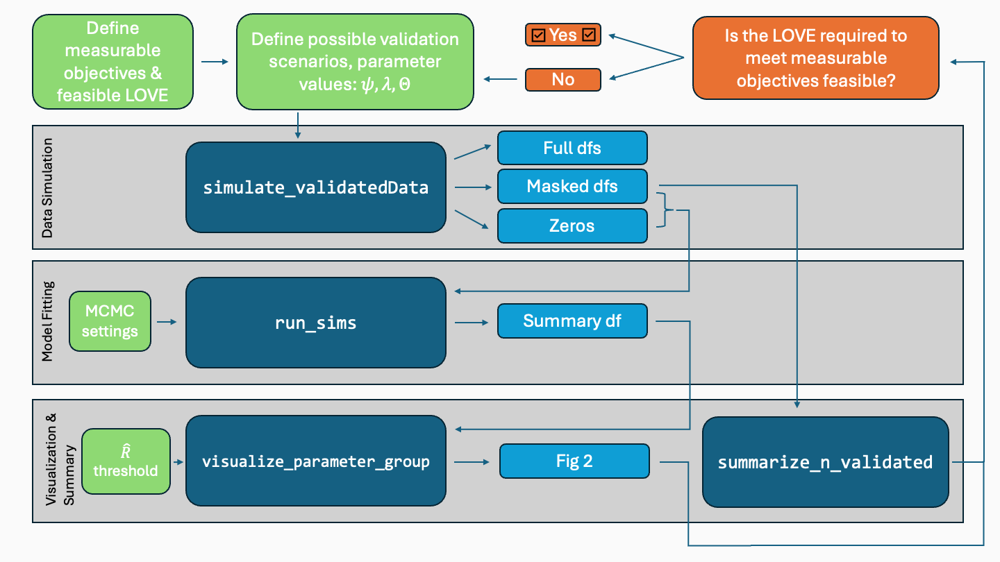

<!-- README.md is generated from README.Rmd. Please edit that file -->

# ValidationExplorer

<!-- badges: start -->

<!-- badges: end -->

This repository contains the `ValidationExplorer` package, as described
in the manuscript “*ValidationExplorer*: Streamlined simulations to
inform bioacoustic study design in the presence of misclassification,”
submitted to *Journal of Data Science*.

**Disclaimer**: This software is preliminary or provisional and is
subject to revision. It is being provided to meet the need for timely
best science. The software has not received final approval by the U.S.
Geological Survey (USGS). No warranty, expressed or implied, is made by
the USGS or the U.S. Government as to the functionality of the software
and related material nor shall the fact of release constitute any such
warranty. The software is provided on the condition that neither the
USGS nor the U.S. Government shall be held liable for any damages
resulting from the authorized or unauthorized use of the software.

## Installation

You can install the development version of ValidationExplorer from
[GitHub](https://github.com/) with:

``` r
# install.packages("pak")
pak::pak("j-oram/BySpeciesValidation")
```

## Purpose

Many ecological studies rely on passive acoustic monitoring (PAM) to
characterize status and trends of multiple species simultaneously. These
methods can be especially useful for gathering field data from rare or
cryptic taxa, such as bats. In the context of bat acoustic data, audio
files obtained via PAM are often preprocessed using automated
algorithms, which filter out non-bat noise and assign species labels
(autoIDs) to each recording. Because autoIDs are subject to
misclassification errors, treating autoIDs as observed data can bias
status and trends estimates. Realistic Bayesian hierarchical models of
bioacoustic data often account for misclassification by formally
including this process as a level in the model, but this requires
additional information to identify all model parameters. When
high-quality prior information and/or auxiliary data are not available,
expert manual review (validation) of a subset of autoIDs often provides
the additional information required to estimate model parameters.

How should one select recordings for validation? This question –
identifying a feasible validation design, in light of logistical
constraints and study objectives – has informed the development of our
package. The goal of `ValidationExplorer` is to provide a suite of
simulation-based tools that streamline comparison of competing
validation designs. We hope our software will allow practitioners to
improve their bioacoustic study design and increase the efficiency of
programs that rely on acoustic monitoring.

## Overview

An overview of the main functionality of our package, which follows the
steps of a simulation study, is illustrated in (Figure
@ref{fig-flowdiag}).:

<div class="figure">


<p class="caption">

Flowchart illustrating the main functionality of the ValidationExplorer
package.
</p>

</div>

### Example

A complete worked example (which is too long for a README file) that
compares possible validation designs using our package is available
here: \[Link to the vignette article inserted here\].
