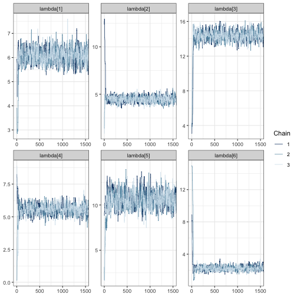
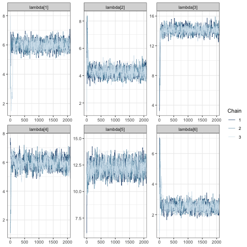
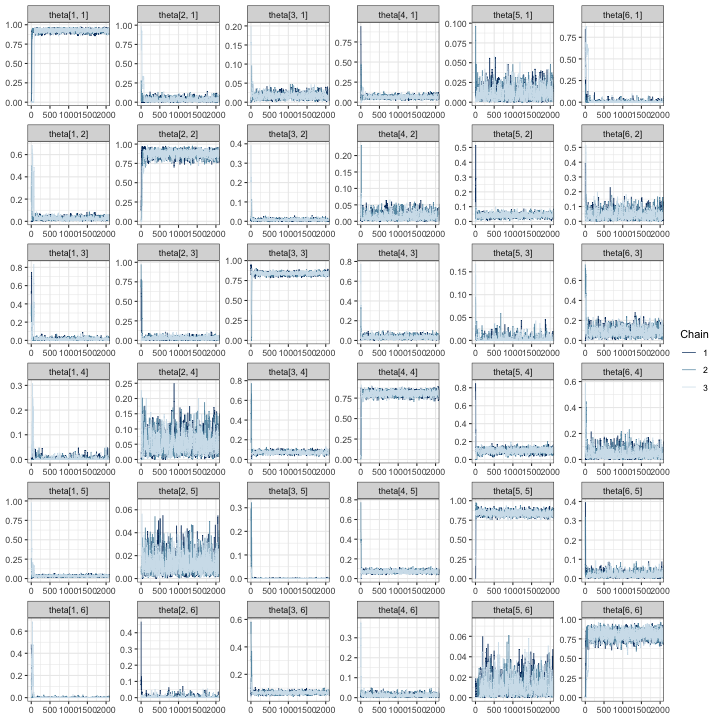

# Vignette: Simulation studies with \`ValidationExplorer\`

Abstract

Our vignette demonstrates the use of the `ValidationExplorer` package to
conduct statistical simulation studies that can aid in the design phase
of bioacoustic studies. In particular, our package facilitates
exploration of the costs and inferential properties (e.g., coverage and
interval widths) of alternative validation designs in the context of the
count detection model framework. Our functions allow the user to specify
a suite of candidate validation designs using either a stratified
sampling procedure or a fixed-effort design type. An example of the
former is provided in the manuscript entitled ‘`ValidationExplorer`:
Streamlined simulations to provide bioacoustic study design guidance in
the presence of misclassification’, which was submitted to the
Applications series of *Methods in Ecology and Evolution*. In this
vignette, we provide further details not covered in the manuscript and
an additional example of data simulation, model fitting, and
visualization of simulation results when using a fixed-effort design
type. Our demonstration here is intended to aid researchers and others
to tailor a validation design that provides useful inference while also
ensuring that the level of effort meets cost constraints.

------------------------------------------------------------------------

**Disclaimer:** This draft manuscript is distributed solely for the
purposes of scientific peer review. Its content is deliberative and
pre-decisional, so it must not be disclosed or released by reviewers.
Because the manuscript has not yet been approved for publication by the
U.S. Geological Survey (USGS), it does not represent any official USGS
funding or policy. Any use of trade, firm, or product names is for
descriptive purposes only and does not imply endorsement by the U.S.
Government.

## Introduction

Automated recording units (ARUs) provide one of the main data sources
for many contemporary ecological studies that aim to provide inference
about status and trends for assemblages of species (Loeb et al. 2015).
As described in the main text, entitled, “`ValidationExplorer`:
Streamlined simulations to provide bioacoustic study design guidance in
the presence of misclassification,” substantial practical interest lies
in identifying cost-effective validation designs that will allow a study
to obtain its measurable objectives. We believe that statistical
simulation studies are a valuable tool for informing study design –
including the validation step – prior to gathering ARU data, and it is
our goal for `ValidationExplorer` to provide those tools in an
approachable package.

This vignette aids exploration of possible validation designs within a
count-detection framework using the `ValidationExplorer` package. As
described in the main text, a validation design is composed of two
parts: a random mechanism for selecting observations to be manually
reviewed by experts (“validated”), and a percentage or proportion that
controls the number of validated recordings. We refer to the random
mechanism as the *design type* and the proportion as the level of
validation effort (LOVE). In the following section we consider five
possible LOVEs and show an example of a fixed effort design.

We emphasize that results from any simulation study – including those
produced using the `ValidationExplorer` package – are conditional on the
settings and assumptions of the study. In the case of the
count-detection model framework that is implemented in
`ValidationExplorer`, the assumptions are

Under these assumptions, we outline the step-by-step use of
`ValidationExplorer` in the following section.

## Conducting a simulation study with a fixed effort design type

### What is a fixed effort design?

In this section, we assume a fixed-effort design type, under which $x\%$
of recordings obtained from each visit to a site are validated by
experts. The level of validation effort is controlled by the value of
$x.$ We begin the process of simulating under this design by defining
the real-world objectives and constraints we anticipate.

### Step 0: Define measurable objectives and constraints

Recall from the main text that the first step – before opening R and
loading `ValidationExplorer` – is to identify and write down the set of
measurable objectives that the data will be used for. Suppose that, for
this example, the measurable objectives and cost constraints are the
same as those in Section 3 of the main text. That is,

Suppose further that the species assemblage is the same as in the main
text. That is, we have six species of interest that co-occur. The
existing prior knowledge (perhaps from another study) about the relative
activity rates and occurrence probabilities for each species are
summarized in Table @ref(tab:assemblage).

### Step 1: Installing and loading required packages

Once measurable objectives and constraints are clearly defined, the next
step is to load the required packages. For first time users, it may be
necessary to install a number of dependencies, as shown by Table 1 in
the main text. If you need to install a dependency or update the
version, run the following, with `your_package_name_here` replaced by
the name of the package:

``` r
install.packages("your_package_name_here")
```

After installing the necessary packages, load these libraries by calling

``` r
library(tidyverse)
library(nimble)
library(coda)
library(rstan)
library(parallel)
library(here)
```

Finally, install and load `ValidationExplorer` by running

``` r
devtools::install_github(repo = "j-oram/ValidationExplorer")
library(ValidationExplorer)
```

With `ValidationExplorer` installed, users have access to all the
functions outlined in the table of functions found in Section
@ref(BigTable).

### Step 2: Simulate data

The first step in a simulation study is to simulate data under each of
the candidate validation designs, which is accomplished with the
`simulate_validatedData` function in `ValidationExplorer`. We begin by
assigning values for the number of sites, visits, and species, as well
as the parameter values in Table @ref(tab:assemblage), which are
existing estimates obtained by Stratton et al. (2022):

``` r
# Set the number of sites, species and visits
nsites <- 30
nspecies <- 6
nvisits <- 4

psi <- c(0.6331, 0.6122, 0.8490, 0.6972, 0.2365, 0.7036)
lambda <- c(5.9347, 4.1603, 14.2532, 6.1985, 11.8649, 2.4050)
```

Note that by running multiple simulation studies with varying numbers of
sites and balanced visits, `ValidationExplorer` allows users to
investigate all elements of the study design prior to data collection.
In addition to specifying the numnber of sites and visits and parameter
values, `simulate_validatedData` requires that the user supply
misclassification probabilities in the form of a matrix, subject to the
constraint that rows in the matrix sum to one. An easy way to simulate a
matrix of probabilities that meet these criteria is to leverage the
`rdirch` function from the `nimble` package:

``` r
# Simulate a hypothetical confusion matrix 
set.seed(10092024) 
Theta <- t(apply(diag(29, nspecies) + 1, 1, function(x) {nimble::rdirch(alpha = x)}))
```

Note that the above definition of `Theta` places high values on the
diagonal of the matrix, corresponding to a high probability of correct
classification. To lower the diagonal values, change the specification
of `diag(29, nspecies)` to a smaller value. For example:

``` r
another_Theta <- t(apply(diag(5, nspecies) + 1, 1, function(x) {
    nimble::rdirch(alpha = x)
  }))
```

`another_Theta` has lower values on the diagonal, and greater
off-diagonal values (i.e., higher probability of misclassification). If
you have specific values you would like to use for the assumed
classification probabilities (e.g., from an experiment), these can be
supplied manually:

``` r
manual_Theta <- matrix(c(0.9, 0.05, 0.01, 0.01, 0.02, 0.01, 
                       0.01, 0.7, 0.21, 0.05, 0.02, 0.01,  
                       0.01, 0.01, 0.95, 0.01, 0.01, 0.01,
                       0.05, 0.05, 0.03, 0.82, 0.04, 0.01,
                       0.01, 0.015,  0.005,  0.005, 0.95, 0.015,
                       0.003, 0.007, 0.1, 0.04, 0.06, 0.79), 
                       byrow = TRUE, nrow = 6)

print(manual_Theta)
```

    ##       [,1]  [,2]  [,3]  [,4] [,5]  [,6]
    ## [1,] 0.900 0.050 0.010 0.010 0.02 0.010
    ## [2,] 0.010 0.700 0.210 0.050 0.02 0.010
    ## [3,] 0.010 0.010 0.950 0.010 0.01 0.010
    ## [4,] 0.050 0.050 0.030 0.820 0.04 0.010
    ## [5,] 0.010 0.015 0.005 0.005 0.95 0.015
    ## [6,] 0.003 0.007 0.100 0.040 0.06 0.790

If you define the classifier manually, make sure the rows sum to 1 by
running

``` r
all(rowSums(manual_Theta) == 1) # want this to return TRUE
```

    ## [1] TRUE

``` r
# If the above returns FALSE, see which one is not 1: 
rowSums(manual_Theta)
```

    ## [1] 1 1 1 1 1 1

With the required inputs defined, we can simulate data:

``` r
sim_data <- simulate_validatedData(
    n_datasets = 10, # For demonstration -- use 50+ for real simulation studies
    nsites = nsites, 
    nvisits = nvisits, 
    nspecies = nspecies, 
    design_type = "FixedPercent", 
    scenarios = c(0.05, 0.1, 0.15, 0.3),
    psi = psi, 
    lambda = lambda,
    theta = Theta, 
    save_datasets = FALSE, # default value is FALSE
    save_masked_datasets = FALSE, # default value is FALSE
    directory = tempdir()
)
```

Note that we specified the design type through the argument
`design_type = "FixedPercent"`, with the possible scenarios defined as
the vector `scenarios = c(0.05, 0.1, 0.15, 0.3)`. These two arguments
specify the set of alternative validation designs we will compare in our
simulation study. Under the first validation design, 5% of recordings
from each visit to a site are validated, while in the second validation
design 10% of recordings from each visit to a site are validated, and so
on. Additionally, we have assumed that all selected recordings are
successfully validated because we have not specified the
`confirmable_limits` argument, which is `NULL` by default. If we
believed that the probability a randomly selected recording from
detector-night $(i,j)$ lies between 0.4 and 0.6 (as in the main
manuscript), for example, we would simulate data as follows:

``` r
sim_data_with_conf_limits <- simulate_validatedData(
    n_datasets = 10,
    nsites = nsites, 
    nvisits = nvisits, 
    nspecies = nspecies, 
    design_type = "FixedPercent", 
    scenarios = c(0.05, 0.1, 0.15, 0.3),
    psi = psi, 
    lambda = lambda,
    theta = Theta, 
    confirmable_limits = c(0.4, 0.6), # specify the range for the confirmability
    save_datasets = FALSE, 
    save_masked_datasets = FALSE, 
    directory = tempdir()
)
```

This argument assumes the probability a call can be confirmed varies
across site-visits, falling within the specified range; we can see this
in the first 10 site-visits from the first dataset simulated under
validation scenario 1:

``` r
# validation scenario 1, dataset 1
sim_data_with_conf_limits$masked_dfs[[1]][[1]] %>% 
  group_by(site, visit) %>% 
  summarize(prop_confirmable = unique(prop_confirmable)) %>% 
  print(n = 10)
```

    ## `summarise()` has regrouped the output.
    ## ℹ Summaries were computed grouped by site and visit.
    ## ℹ Output is grouped by site.
    ## ℹ Use `summarise(.groups = "drop_last")` to silence this message.
    ## ℹ Use `summarise(.by = c(site, visit))` for per-operation grouping
    ##   (`?dplyr::dplyr_by`) instead.

    ## # A tibble: 120 × 3
    ## # Groups:   site [30]
    ##     site visit prop_confirmable
    ##    <int> <int>            <dbl>
    ##  1     1     1            0.496
    ##  2     1     2            0.440
    ##  3     1     3            0.566
    ##  4     1     4            0.486
    ##  5     2     1            0.426
    ##  6     2     2            0.556
    ##  7     2     3            0.511
    ##  8     2     4            0.429
    ##  9     3     1            0.513
    ## 10     3     2            0.493
    ## # ℹ 110 more rows

We continue our demonstration using the `sim_data` object, which assumes
that all selected recordings can be confirmed.

To understand the output from `simulate_validatedData`, we can
investigate `sim_data`. The output is a list, containing three objects:

``` r
names(sim_data)
```

    ## [1] "full_datasets" "zeros"         "masked_dfs"

We examine each of these objects below:

- `full_datasets`: A list of length `n_datasets` with unmasked datasets.
  These are the datasets under complete validation so that every
  recording has an autoID and a true species label. We opted to not save
  these datasets to the working directory by setting
  `save_datasets = FALSE`. If we had specified `save_datasets = TRUE`,
  then these will be saved individually in `directory` as
  `dataset_n.rds`, where `n` is the dataset number. As an example of one
  element in `sim_data$full_datasets`, we examine the third simulated
  full dataset:

``` r
full_dfs <- sim_data$full_datasets
head(full_dfs[[3]]) # Dataset number 3 if all recordings were validated
```

    ## # A tibble: 6 × 10
    ## # Groups:   site, visit [1]
    ##    site visit true_spp id_spp lambda   psi  theta     z count    Y.
    ##   <int> <int>    <int>  <int>  <dbl> <dbl>  <dbl> <int> <int> <int>
    ## 1     1     1        1      1   5.93 0.633 0.954      1     4    24
    ## 2     1     1        1      1   5.93 0.633 0.954      1     4    24
    ## 3     1     1        1      1   5.93 0.633 0.954      1     4    24
    ## 4     1     1        1      1   5.93 0.633 0.954      1     4    24
    ## 5     1     1        4      2   6.20 0.697 0.0289     1     1    24
    ## 6     1     1        3      3  14.3  0.849 0.826      1    10    24

Notice that in addition to the site, visit, true species and autoID
(`id_spp`) columns, the parameter values (`lambda`, `psi`, and `theta`)
are given for each true species-autoID combination. In addition, the
occupancy state `z` for the true species is given and the `count` of
calls at that site visit with a specific true species-autoID label
combination. For example, at site 1, visit 1, there are four calls from
species 1 that are assigned autoID 1, yielding 4 rows with `count = 4`.
There is also one call from species 4 that was assigned a species 2
label with probability 0.02893559. Because this happened once, it is
documented with `count = 1` and only occupies a single row. Next, we can
see that there were 10 calls that were correctly identified as species
3; ten rows will have `true_spp = 3` and `autoID = 3`. Finally, the `Y.`
column tells us how many observations were made from all species at that
site visit; for visit 1 to site 1, the unique value is 24. That is, the
25th row of this dataset will contain the first observation from visit 2
to site 1.

- `zeros`: A list of length `n_datasets` containing the true
  species-autoID combinations that were never observed at each site
  visit. These zero counts are necessary for the model to identify
  occurrence probabilities and relative activity rates. The `count`
  column, which, again, contains the count of each
  site-visit-true_spp-id_spp combination, is zero for all entries. For
  example, in dataset 3 (below), species 2 was not present at site 1, so
  it could not be classified as species 1 (first row). Additionally,
  species 3 was present at site 1, but it was never classified as
  species 1 on visit 1 (second row). If `save_datasets = TRUE`, the
  zeros for each dataset will also be saved in `directory` individually
  as `zeros_in_dataset_n.rds`, where `n` is the dataset number.

``` r
zeros <- sim_data$zeros

# The site-visit-true_spp-autoID combinations that were never observed in
# dataset 3. Notice that count = 0 for all rows! 
head(zeros[[3]]) 
```

    ## # A tibble: 6 × 10
    ## # Groups:   site, visit [1]
    ##    site visit true_spp id_spp lambda   psi   theta     z count    Y.
    ##   <int> <int>    <int>  <int>  <dbl> <dbl>   <dbl> <int> <int> <int>
    ## 1     1     1        2      1   4.16 0.612 0.0286      0     0    24
    ## 2     1     1        3      1  14.3  0.849 0.0137      1     0    24
    ## 3     1     1        4      1   6.20 0.697 0.0426      1     0    24
    ## 4     1     1        5      1  11.9  0.236 0.00559     0     0    24
    ## 5     1     1        6      1   2.40 0.704 0.00312     1     0    24
    ## 6     1     1        1      2   5.93 0.633 0.0159      1     0    24

- `masked_dfs`: A nested list containing each dataset masked under each
  scenario. For example, `masked_dfs[[4]][[3]]` contains dataset 3,
  assuming that it was validated according to scenario 4 (30% of
  recordings randomly sampled from each site-visit for validation). If
  `save_masked_datasets = TRUE`, then each dataset/scenario combination
  is saved individually in `directory` as
  `dataset_n_masked_under_scenario_s.rds`, where `n` is the dataset
  number and `s` is the scenario number.

``` r
masked_dfs <- sim_data$masked_dfs

# View dataset 3 subjected to the validation design in scenario 4: 
# randomly select and validate 30% of recordings from the first visit 
# to each site 
head(masked_dfs[[4]][[3]], 10)
```

    ## # A tibble: 10 × 13
    ##     site visit true_spp id_spp lambda   psi  theta     z count    Y.
    ##    <int> <int>    <int>  <int>  <dbl> <dbl>  <dbl> <int> <int> <int>
    ##  1     1     1       NA      1   5.93 0.633 0.954      1     4    24
    ##  2     1     1       NA      1   5.93 0.633 0.954      1     4    24
    ##  3     1     1       NA      1   5.93 0.633 0.954      1     4    24
    ##  4     1     1       NA      1   5.93 0.633 0.954      1     4    24
    ##  5     1     1       NA      2   6.20 0.697 0.0289     1     1    24
    ##  6     1     1        3      3  14.3  0.849 0.826      1    10    24
    ##  7     1     1        3      3  14.3  0.849 0.826      1    10    24
    ##  8     1     1        3      3  14.3  0.849 0.826      1    10    24
    ##  9     1     1       NA      3  14.3  0.849 0.826      1    10    24
    ## 10     1     1        3      3  14.3  0.849 0.826      1    10    24
    ## # ℹ 3 more variables: selected <dbl>, unique_call_id <chr>,
    ## #   scenario <int>

The name of this nested list comes from the way that validation effort
is simulated: recordings that are not selected for validation have their
`true_spp` label masked with an `NA`. Notice that in the example output,
all entries in the dataset are identical to the unmasked version output
in `full_dfs` above, with the exception of the `true_spp` column. From
this column we can see that calls 1-5 and 9 were not selected for
validation (because `true_spp = NA`), while recordings 6-8 and 10 were
(because the true species label is not marked as `NA`).

#### Summarize validation effort

For most simulations, it will be useful to summarize the number of
recordings that are validated under a given validation design and
scenario. This can be accomplished using the `summarize_n_validated`
function:

``` r
summarize_n_validated(
  data_list = sim_data$masked_dfs, 
  theta_scenario = "1", 
  scenario_numbers = 1:4
)
```

    ## # A tibble: 4 × 4
    ##   theta_scenario scenario n_selected n_validated
    ##   <chr>          <chr>         <dbl>       <dbl>
    ## 1 1              1              218.        218.
    ## 2 1              2              375.        375.
    ## 3 1              3              540.        540.
    ## 4 1              4             1021.       1021.

We can see here that any of the validation designs considered in our
simulations will remain well within budget.

### Step 3: MCMC tuning

Running a complete simulation study can be time consuming. In an effort
to help users improve the efficiency of their simulations, we provide
the `tune_mcmc` function, which outputs information about possible
values for the warmup and total number of iterations required for the
MCMC to reach approximate convergence. This function takes in a masked
dataset and the corresponding zeros, fits a model to these data, and
outputs an estimated run time for 10,000 iterations, as well as the
estimated number of required warmup and total iterations. These are
intended to assist tuning of the MCMC algorithm, which is done by the
user in the following steps, which we walk through in greater detail
below:

1.  Use `tune_mcmc` to fit a model with multiple long chains.

2.  Create trace plots for all model parameters.

3.  Examine effective sample sizes $n_{\text{eff}}$ and Gelman-Rubin
    statistics $\widehat{R}$ for all parameters.

4.  Choose values for the number of iterations and warmup that are
    slightly larger than what is needed based on steps 1-3. This may
    help ensure that a greater number of model fits are available to
    inform simulation study results.

#### Fit a model

As in the main text, we use a dataset from the scenario with the lowest
number of validated recordings, as we expect the greatest number of
iterations for this scenario. In our example, this is scenario 1 , in
which an average of $\approx 218$ recordings are validated per dataset
(Section @ref(summarizeEffort)).

``` r
scenario_number <- 1
dataset_number <- sample(1:length(masked_dfs[[scenario_number]]), 1)

tune_list <- tune_mcmc(
  dataset = sim_data$masked_dfs[[scenario_number]][[dataset_number]], 
  zeros = sim_data$zeros[[dataset_number]] 
)
```

    ## [1] "Fitting MCMC in parallel ... this may take a few minutes"

The output from `tune_mcmc` is a list containing draws from the fitted
model, the time required to fit the model with 10,000 draws, MCMC
diagnostics and guesses for the number of iterations and warmup required
to reliably fit a model. If the guessed values for total iterations
and/or warmup are greater than 10,000 draws, an error is issued. We can
see the names for each object by running the following block:

``` r
names(tune_list)
```

    ## [1] "max_iter_time"   
    ## [2] "min_warmup"      
    ## [3] "min_iter"        
    ## [4] "fit"             
    ## [5] "MCMC_diagnostics"

The first element is the time required to fit a model with three chains
of 10,000 iterations each:

``` r
tune_list$max_iter_time
```

    ## Time difference of 5.053052 mins

This may seem insignificant, but over the course of an entire
simulations study with 5 scenarios $\times$ 50 datasets, that
corresponds to around 8 hours of run time. Using fewer than 10,000
iterations will substantially reduce the time to run a simulation study.

#### Create trace plots

To decide the number of iterations and warmup for use in a simulation
study, we recommend beginning by creating trace plots, which show how
the sampled values of a parameter evolve over the course of each Markov
chain. To ensure the MCMC algorithm will characterize the posterior
distribution well, we need to check that chains are stationary and
mixing well, and that effective sample sizes are sufficiently large to
characterize the posterior. Trace plots are especially useful for
assessing the first of these. To create a trace plot using the bayesplot
package (Gabry et al. 2019) for a single parameter, run the following:

``` r
# Load bayesplot package specifically designed for visualizing 
library(bayesplot)
```

    ## This is bayesplot version 1.13.0

    ## - Online documentation and vignettes at mc-stan.org/bayesplot

    ## - bayesplot theme set to bayesplot::theme_default()

    ##    * Does _not_ affect other ggplot2 plots

    ##    * See ?bayesplot_theme_set for details on theme setting

``` r
# extract the fitted model from tune_mcmc output
fit <- tune_list$fit

# create traceplot
mcmc_trace(fit, pars = "lambda[5]")
```


{#fig:FE_lambda5_trace}

We can see that far fewer than 10,000 iterations are likely required
because the chains are mixing well after a few hundred iterations. This
is shown by strongly overlapping chains, with no one chain appearing by
itself in a region of the parameter space. Chains also appear to be
stationary because they do not wander vertically substantially after the
first few hundred iterations.

We need to check that chains are stationary and mixing for all
parameters. One way to accelerate visual inspection this is through the
`regex_pars` argument, which shows relative activity parameters for all
species as in the following three code blocks.

``` r
mcmc_trace(fit, regex_pars = "lambda")
```


{#fig:FE_allLambda_trace}

``` r
mcmc_trace(fit, regex_pars = "psi")
```


{#fig:FE_allPsi_trace}

``` r
# create a traceplot for all elements of the confusion matrix
mcmc_trace(fit, regex_pars = "theta")
```


{#fig:FE_allTheta_trace}

In all of the trace plots for all of the parameters, chains appear to
mix quickly, meaning that it is possible a far smaller number of
iterations may be suitable for a simulation study. A good place to start
for reducing the number of iterations is from the output given by
`tune_mcmc`. In our case, we can see that a guess for the minimum number
of iterations is 1500 with a warmup of 500:

``` r
tune_list$min_iter
```

    ## [1] 1500

``` r
tune_list$min_warmup
```

    ## [1] 500

It is possible to use these values to zoom in on the trace plots by
using the `window` argument:

``` r
mcmc_trace(fit, regex_pars = "lambda", window = c(0, tune_list$min_iter))
```



{#fig:FE_lambdaWindow_trace}

Once again, we see the three chains overlap strongly after around 500
iterations and sample around a horizontal line.

After making traceplots and zooming in for all parameters (not all plots
are shown here), it appears that the guessed warmup value of 500 output
from `tune_mcmc` is a reasonable choice. Even so, we increase our
iterations and warmup beyond these minimum values in Section
@ref(runSims) to avoid simulations failing due to convergence.

#### Examine effective sample size and Gelman-Rubin statistics

As a final step, we examine the effective sample sizes (out of 10,000
draws) and $\widehat{R}$ values. The effective sample size statistics
`ess_bulk` and `ess_tail` are MCMC diagnostic statistics that summarizes
the number of effectively independent draws from a parameter’s posterior
distribution the Markov chain contains. If a parameter has a large value
in the `ess_bulk` column, then it is likely that inference based on
sampled draws will characterize the center of the posterior distribution
well. The `ess_tail` column, on the other hand, describes how much
information is available about posterior tail probabilities. Once again,
we want a large value for `ess_tail`, preferably `ess_tail`$\geq 250$.

``` r
tune_list$MCMC_diagnostics
```

    ##      parameter   ess_bulk
    ## 1    lambda[1]  4054.4236
    ## 2    lambda[2]  3514.6735
    ## 3    lambda[3]  3036.5144
    ## 4    lambda[4]  2378.0551
    ## 5    lambda[5]  2585.8105
    ## 6    lambda[6]  3176.6072
    ## 7       psi[1] 28909.0859
    ## 8       psi[2] 19763.1950
    ## 9       psi[3] 29835.3203
    ## 10      psi[4] 21712.9515
    ## 11      psi[5] 25742.8365
    ## 12      psi[6] 10267.1298
    ## 13 theta[1, 1]  1542.5891
    ## 14 theta[2, 1]  3717.6854
    ## 15 theta[3, 1]  1391.4888
    ## 16 theta[4, 1]   709.3102
    ## 17 theta[5, 1]  1188.8520
    ## 18 theta[6, 1]  3278.1872
    ## 19 theta[1, 2]  1712.3623
    ## 20 theta[2, 2]  3545.0542
    ## 21 theta[3, 2]  2291.4777
    ## 22 theta[4, 2]  2651.2734
    ## 23 theta[5, 2]  3115.4405
    ## 24 theta[6, 2]  2779.3062
    ## 25 theta[1, 3]   763.5706
    ## 26 theta[2, 3]  1687.6679
    ## 27 theta[3, 3]  3183.6525
    ## 28 theta[4, 3]  1608.4691
    ## 29 theta[5, 3]  1423.8439
    ## 30 theta[6, 3]  1199.1200
    ## 31 theta[1, 4]  2816.1549
    ## 32 theta[2, 4]  2833.7896
    ## 33 theta[3, 4]  3459.4692
    ## 34 theta[4, 4]  2169.4721
    ## 35 theta[5, 4]  2350.5577
    ## 36 theta[6, 4]  4985.5655
    ## 37 theta[1, 5]  5251.3568
    ## 38 theta[2, 5]  2670.2778
    ## 39 theta[3, 5]  3255.1403
    ## 40 theta[4, 5]  5303.9713
    ## 41 theta[5, 5]  2332.3713
    ## 42 theta[6, 5]  4407.2662
    ## 43 theta[1, 6]  3204.5839
    ## 44 theta[2, 6]  3106.7680
    ## 45 theta[3, 6]  3097.9977
    ## 46 theta[4, 6]  4308.8156
    ## 47 theta[5, 6]  3254.2060
    ## 48 theta[6, 6]  3122.1714
    ##      ess_tail      Rhat
    ## 1   5770.1855 1.0011266
    ## 2   3894.8708 1.0002901
    ## 3   4456.8951 1.0004039
    ## 4   4572.3424 1.0004010
    ## 5   5619.9162 1.0007189
    ## 6   3770.7663 1.0011671
    ## 7  28348.5238 1.0000918
    ## 8  15742.4672 1.0001141
    ## 9  30060.1558 1.0000642
    ## 10 25544.4414 0.9999419
    ## 11 18974.0253 1.0001736
    ## 12 12266.2976 1.0005568
    ## 13  2362.2184 1.0036248
    ## 14  5137.6162 1.0008359
    ## 15  2236.1813 1.0024110
    ## 16   507.7748 1.0052294
    ## 17  1445.3176 1.0040228
    ## 18  3649.3393 1.0006421
    ## 19   774.5759 1.0029408
    ## 20  5579.7800 1.0003422
    ## 21  2245.4984 1.0014262
    ## 22  3716.6232 1.0002864
    ## 23  1967.8070 1.0013981
    ## 24  3766.9523 1.0008955
    ## 25   319.7502 1.0047156
    ## 26  2648.0894 1.0015834
    ## 27  6093.6712 1.0006143
    ## 28  2643.0294 1.0009317
    ## 29  1011.0957 1.0010778
    ## 30  3058.8395 1.0034046
    ## 31  2786.9224 1.0019193
    ## 32  1512.8902 1.0008602
    ## 33  6046.2850 1.0004885
    ## 34  5214.6979 1.0014410
    ## 35  4079.5499 1.0008002
    ## 36  5831.5408 1.0009314
    ## 37  5662.5413 1.0001760
    ## 38  3606.1415 1.0011935
    ## 39  3606.0417 1.0003796
    ## 40  7242.1309 1.0001506
    ## 41  6331.6009 1.0007064
    ## 42  4941.2201 1.0003350
    ## 43  3980.9929 1.0007695
    ## 44  3922.2798 1.0006531
    ## 45  4576.2506 1.0007187
    ## 46  6274.8528 1.0005013
    ## 47  3855.1332 1.0006519
    ## 48  5039.8867 1.0008938

For all parameters, the bulk and tail effective sample sizes are fairly
large, meaning that even with fewer than 10,000 draws, we could expect
$n_{\text{eff}} \geq 250,$ allowing us to characterize both the center
and tails of the posteriors for all parameters with these draws.
Furthermore, the $\widehat{R}$ values for all parameters is near 1. In
general, we want values of $\widehat{R} \leq 1.1$ for chains to be
considered converged. We can double check by recomputing these
statistics on shortened chains:

``` r
# for each chain, extract iterations 1001:2500 for all parameters
shortened <- lapply(fit, function(x) x[1001:2500,])

# summarize the shortened chains and select the effective sample 
# size columns. mcmc_sum is an internal function used inside of `run_sims`, but
# we use it here to quickly obtain MCMC diagnostics for each parameter
mcmc_sum(shortened, truth = rep(0, ncol(shortened[[1]]))) %>%
  select(parameter, ess_bulk, ess_tail, Rhat)
```

    ##      parameter  ess_bulk
    ## 1    lambda[1]  658.2022
    ## 2    lambda[2]  550.5922
    ## 3    lambda[3]  576.4797
    ## 4    lambda[4]  450.2969
    ## 5    lambda[5]  455.9770
    ## 6    lambda[6]  660.7857
    ## 7       psi[1] 4649.8232
    ## 8       psi[2] 4378.2597
    ## 9       psi[3] 4500.3756
    ## 10      psi[4] 3788.2563
    ## 11      psi[5] 4383.7439
    ## 12      psi[6] 1807.7268
    ## 13 theta[1, 1]  360.2251
    ## 14 theta[2, 1]  663.9001
    ## 15 theta[3, 1]  376.1326
    ## 16 theta[4, 1]  247.2145
    ## 17 theta[5, 1]  239.8531
    ## 18 theta[6, 1]  609.7759
    ## 19 theta[1, 2]  505.3942
    ## 20 theta[2, 2]  602.9410
    ## 21 theta[3, 2]  403.8982
    ## 22 theta[4, 2]  398.0627
    ## 23 theta[5, 2]  642.8147
    ## 24 theta[6, 2]  534.5960
    ## 25 theta[1, 3]  211.9127
    ## 26 theta[2, 3]  320.0592
    ## 27 theta[3, 3]  588.3401
    ## 28 theta[4, 3]  282.1578
    ## 29 theta[5, 3]  276.4982
    ## 30 theta[6, 3]  229.8418
    ## 31 theta[1, 4]  615.6445
    ## 32 theta[2, 4]  669.9655
    ## 33 theta[3, 4]  543.2731
    ## 34 theta[4, 4]  614.7354
    ## 35 theta[5, 4]  458.8077
    ## 36 theta[6, 4]  853.7886
    ## 37 theta[1, 5]  863.0625
    ## 38 theta[2, 5]  417.8105
    ## 39 theta[3, 5]  564.0875
    ## 40 theta[4, 5]  904.1084
    ## 41 theta[5, 5]  559.4221
    ## 42 theta[6, 5]  681.0388
    ## 43 theta[1, 6]  598.9303
    ## 44 theta[2, 6]  574.0554
    ## 45 theta[3, 6]  560.4546
    ## 46 theta[4, 6]  640.0082
    ## 47 theta[5, 6]  583.5810
    ## 48 theta[6, 6]  881.0856
    ##     ess_tail     Rhat
    ## 1   955.7715 1.003779
    ## 2   726.2727 1.009008
    ## 3   888.6949 1.006161
    ## 4   744.7443 1.006063
    ## 5   917.9029 1.007533
    ## 6  1008.3208 1.005419
    ## 7  4279.6838 1.000143
    ## 8  4283.3146 1.000344
    ## 9  4402.6275 1.000199
    ## 10 3946.1370 1.001289
    ## 11 4126.1893 1.000702
    ## 12 2928.5848 1.000919
    ## 13  996.1972 1.008518
    ## 14  887.6737 1.006361
    ## 15  599.4371 1.004398
    ## 16  214.0841 1.015350
    ## 17  226.6231 1.011429
    ## 18  642.8152 1.000313
    ## 19  701.7421 1.004619
    ## 20  846.2510 1.007544
    ## 21  651.9722 1.005891
    ## 22  557.4768 1.004191
    ## 23  606.3136 1.008394
    ## 24  808.7405 1.004095
    ## 25  115.4204 1.008644
    ## 26  300.4538 1.004973
    ## 27 1125.4872 1.007956
    ## 28  574.9396 1.010124
    ## 29  231.7699 1.004734
    ## 30  468.2777 1.018594
    ## 31  639.3157 1.008925
    ## 32  735.9931 1.002426
    ## 33 1109.1766 1.004559
    ## 34 1127.4199 1.003270
    ## 35  597.8274 1.007086
    ## 36 1166.9474 1.001054
    ## 37  897.7508 1.002499
    ## 38  566.1289 1.001707
    ## 39  599.5925 1.003324
    ## 40 1109.2376 1.002278
    ## 41 1006.9323 1.004774
    ## 42  722.0841 1.003327
    ## 43  975.7490 1.000567
    ## 44  496.1368 1.005828
    ## 45  820.7931 1.006667
    ## 46  911.4349 1.003882
    ## 47  642.1363 1.001772
    ## 48 1582.9839 1.003882

These results appear satisfactory, with effective sample sizes in both
the tail and bulk of the posterior distributions of more than 250 and
$\widehat{R}$ near 1. Based on the results of MCMC tuning, it appears
that using an MCMC with at least 1500 iterations with at least 500
discarded as warmup should to produce good results for our simulation
study.

#### Set iterations for simulation

Based on our findings in the MCMC tuning step, we set the number of
iterations for simulation to be slightly higher to guard against
convergence issues that preclude using a fitted model for inference:

``` r
# to be used in the following section 
iters_for_sims <- tune_list$min_iter + 1000
warmup_for_sims <- tune_list$min_warmup + 500
```

#### A note about non-convergence while tuning

In some instances, we have run `tune_mcmc` with a dataset and received a
series of error messages that convergence was not reached in under
10,000 iterations. If this persists after trying to fit several other
datasets, we have several options:

1.  We could increase the number of iterations in the simulation study
    to be above 10,000 – perhaps to 20,000 and settle for a longer run
    time of the simulation study.

2.  We could take this as a sign that the level of effort is
    insufficient to identify model parameters. In this case, this
    scenario should not be considered.

In our experience fitting these models, the second option seems to often
be the case, and we encourage users to remove scenarios from
consideration if models fit during the tuning step do not reach
convergence within 10,000 iterations. It is possible that all validation
scenarios – including ones with very large levels of validation effort –
will lead to a lack of convergence if the number of sites and visits are
very low, in which case the number of sites and visits should be
re-evaluated.

We emphasize that the results from `tune_mcmc` are from a single model
fit; they are supplied only as guidelines, and we encourage users to
increase the number of iterations above the minimum values output from
`tune_mcmc`. While each model fit will take slightly longer with an
increased number of total iterations, this approach may save time in the
long run by avoiding the need to re-run simulations.

### Step 4: Fit models to simulated data

With the simulated dataset and some informed choices about tuning of the
MCMC, we use `run_sims` to run the simulations:

``` r
sims_output <- run_sims(
         data_list = sim_data$masked_dfs, 
         zeros_list = sim_data$zeros, 
         DGVs = list(lambda = lambda, psi = psi, theta = Theta), 
         theta_scenario_id = "FE", # for "fixed effort"
         parallel = TRUE, 
         niter = iters_for_sims, 
         nburn = warmup_for_sims,  
         thin = 1,
         save_fits = TRUE, 
         save_individual_summaries_list = FALSE, 
         directory = tempdir() 
)
```

The output object, `sims_output` is a dataframe with summaries of the
MCMC draws for each parameter estimated from each dataset under each
validation scenario. Summaries include the posterior mean, standard
deviation, Naive standard error, Time-series standard error, quantiles
for 50% and 95% posterior intervals, median, and MCMC diagnostics
(Gelman-Rubin statistic, and effective samples sizes in the tails and
bulk of the distribution).

``` r
str(sims_output)
```

    ## 'data.frame':    1920 obs. of  19 variables:
    ##  $ parameter     : chr  "lambda[1]" "lambda[2]" "lambda[3]" "lambda[4]" ...
    ##  $ Mean          : num  6.05 4.8 14.05 5.99 11.81 ...
    ##  $ SD            : num  0.356 0.345 0.448 0.485 0.801 ...
    ##  $ Naive SE      : num  0.0053 0.00515 0.00667 0.00723 0.01194 ...
    ##  $ Time-series SE: num  0.0141 0.0153 0.0175 0.0261 0.0295 ...
    ##  $ 2.5%          : num  5.38 4.18 13.16 5.03 10.26 ...
    ##  $ 25%           : num  5.8 4.57 13.76 5.66 11.29 ...
    ##  $ 50%           : num  6.03 4.79 14.04 6 11.79 ...
    ##  $ 75%           : num  6.28 5.01 14.33 6.32 12.32 ...
    ##  $ 97.5%         : num  6.77 5.56 14.97 6.92 13.42 ...
    ##  $ Rhat          : num  1 1.01 1.01 1.01 1.01 ...
    ##  $ ess_bulk      : num  643 539 520 269 621 ...
    ##  $ ess_tail      : num  720 687 874 545 703 ...
    ##  $ truth         : num  5.93 4.16 14.25 6.2 11.86 ...
    ##  $ capture       : num  1 0 1 1 1 1 1 1 1 1 ...
    ##  $ converge      : num  1 1 1 1 1 1 1 1 1 1 ...
    ##  $ theta_scenario: chr  "FE" "FE" "FE" "FE" ...
    ##  $ scenario      : int  1 1 1 1 1 1 1 1 1 1 ...
    ##  $ dataset       : int  1 1 1 1 1 1 1 1 1 1 ...

Note that we fit all models in parallel to reduce simulation time; we
encourage users to do the same. However, if you fit models with
`parallel = FALSE` in `run_sims`, the console will display the messages
NIMBLE prints as it compiles code for each model. Internally, we specify
a custom distribution to compute the marginal probabilities for
ambiguous autoID labels, and you will see a warning about overwriting a
custom user-specified distribution if `parallel = FALSE`. These warnings
can be safely ignored.

### Step 5: Visualize simulations

Once models have been fit to all simulated datasets, you can visualize
results using several functions. We recommend beginning with the most
detailed functions, which are `visualize_parameter_group` and
`visualize_single_parameter`. The plots output from these functions show
many following features of the simulation study. These are

- Facet grids: parameters (only for `visualize_parameter_group`)
- X-axis: Manual verification scenario
- y-axis: parameter values
- Small grey error bars: 95% posterior interval for an individual model
  fit where all parameters were below `convergence_threshold`.
- Colored error bars: average 95% posterior interval across all
  converged models under that scenario.
- Color: Coverage, or the rate at which 95% posterior intervals contain
  the true data-generating parameter value.
- Black points: the true value of the parameter
- Red points: average posterior mean

The `visualize_parameter_group` function is useful for examining an
entire set of parameters, such as all relative activity parameters. For
example, we can visualize the inference for the relative activity
parameters in the first three scenarios in our simulation study above by
running the code below.

``` r
visualize_parameter_group(
  sim_summary = sims_output, 
  pars = "lambda", 
  theta_scenario = 1, 
  scenarios = 1:4,
  convergence_threshold = 1.05
)
```


Example output from the `visualize_parameter_group` function. Results
are faceted by parameter, with the x-axis indicating the validation
scenario number, and the y-axis showing the data generating value (black
point). Red points show average posterior means, small grey intervals
show 95% posterior intervals from converged model fits and colored
intervals are average 95% posterior intervals. Coverage is shown by
color, with blue corresponding to low coverage. {#fig:vizGroup}

The output shown in Figure @ref(fig:vizGroup) indicates that under all
validation scenarios we considered, the expected inference for relative
activity rates of species 1-4 and 6 meets our measurable objectives: the
posterior interval width is less than three for these species and there
is minimal estimation error. However, note that under validation
scenario 1 and 2, fewer of the models converged within 2500 iterations
of the MCMC, which is visible from smaller number of grey intervals.
This suggests that a higher level of validation effort could be
beneficial. Additionally, average interval width is never below 3 for
species 5; none of the designs considered here meet the measurable
objective for this species. We can see this more clearly by examining
output through alternative visualization functions.

A first step would be to use `visualize_single_parameter`, which takes
the same arguments as the previous visualization function:

``` r
visualize_single_parameter(
  sims_output, par = "lambda[5]", 
  theta_scenario = 1, 
  scenarios = 1:4, 
  convergence_threshold = 1.05
)
```


Example output from `visualize_single_parameter` is similar to that of
`visualize_parameter_group`: the x-axis shows the validation scenario,
and the y-axis shows the true value of the parameter (black point).
Average posterior means are shown by red points, individual 95%
posterior intervals from converged model fits are shown as small grey
error bars and average 95% posterior intervals are shown by the larger
colored error bars. The coverage is indicated by color. {#fig:vizOne}

The greater detail of `visualize_single_parameter` in Figure
@ref(fig:vizOne) underscores the difference in the number of converged
models, shown by the number grey 95% posterior interval for each
converged model fit. The visualization also helps clarify that while
average interval width is near 3 in scenario 2, it is still acceptable
for our measurable objectives. Coverage for most relative activity
parameters is also near-nominal under this validation scenario, which
requires that around 375 recordings be validated in an average dataset.
This can also be seen using the `plot_width_vs_calls` function (Figure
@ref(fig:plotWidth)), which compares average interval widths (and the
IQR for interval widths) across scenarios based on the number of
recordings validated. An example is provided below:

``` r
# obtain summary of validation effort as an object that can be used with 
# the summary plot functions plot_x_vs_calls
s <-  summarize_n_validated(
  data_list = sim_data$masked_dfs, 
  theta_scenario = "FE", # must not be NULL for the plot_X_vs_calls functions
  scenario_numbers = 1:4
)
```

``` r
plot_width_vs_calls(
  sim_summary = sims_output, 
  calls_summary = s, 
  regex_pars = "lambda", 
  theta_scenario = "FE", 
  scenarios = 2:5
) + # add horizontal line at target 95% CI width 
  geom_hline(yintercept = 3, linetype = "dotted") 
```


Example output from `plot_width_vs_calls`. The x-axis shows the number
of validated recordings. Note that the level of effort increases with
scenario number for the fixed-effort designs; this may not always be the
case, for example, with a stratified-by-species design as in the main
text. The y-axis shows the value of the average 95% posterior interval
width (point). The middle 50% of interval widths for each parameter are
shown by the error bars. Color indicates the parameter. {#fig:plotWidth}

We provide analogous functions `plot_coverage_vs_calls` and
`plot_bias_vs_calls` taking identical arguments that show how coverage
and estimation error change with the number of calls validated. Note
that in all of our visualization functions, if no fitted models have
$\widehat{R} \leq c$ for all parameters, where $c$ is the specified
convergence threshold under a given scenario, then the scenario will not
appear on the x-axis. In our example, we used $c = 1.1$.

To ensure that there aren’t substantial problems with estimation of
other model parameters, we can create plots for $\psi$ and $\Theta$:

``` r
visualize_parameter_group(
  sim_summary = sims_output, 
  pars = "psi", 
  theta_scenario = 1, 
  scenarios = 1:4,
  convergence_threshold = 1.05
)
```


We encourage users to check inference for other model parameters, even
if they are not explicitly of interest based on measurable objectives.
Here, we examine $\mathbf{ψ}$. Note that coverage for several parameters
is slightly low. For the purpose of exposition, we only fit 10 datasets
and we expect that coverage would be near nominal levels if 50 or more
datasets were used in simulation. {#fig:vizPsi}

``` r
visualize_parameter_group(
  sim_summary = sims_output, 
  pars = "theta", 
  theta_scenario = 1, 
  scenarios = 1:4,
  convergence_threshold = 1.05
)
```


Checking inference for the elements of the classification matrix
$\Theta$. For most parameters (facets), validation scenario 2 appears to
lead to minimal estimation error and near-nominal coverage.
{#fig:plotTheta}

The simulation results shown in Figure @ref(fig:vizPsi) and
@ref(fig:plotTheta) don’t immediately cause concern that inference for
relative activity rates will be severely compromised for any of these
validation designs. Some parameters have slightly low coverage, but we
believe this is mostly due to the small number of datasets used in this
example; users should increase the number of datasets to at least 50,
which we expect would lead to coverage near nominal levels.

### Take-aways from the Fixed-Effort Simulations

Based on Figures @ref(fig:vizGroup) - @ref(fig:plotWidth), we can rule
out validation scenario 1, because the expected width of 95% posterior
intervals is greater than the threshold value of 3. Because of this, we
might choose validation scenario 2 as one possible fixed effort
validation design. This fixed effort design assumes that 10% of
recordings from each site-night are randomly selected for validation,
leading to around 375 recordings being validated per dataset. In our
simulations, posterior means for each $\lambda_{k}$ appear to be nearly
unbiased, with near-nominal coverage and average posterior interval
widths less than or equal to 3 for this scenario. However, it is
possible that for a given dataset, the interval width for $\lambda_{5}$
will be larger than 3, regardless of the number of validated calls;
error bars in Figure @ref(fig:plotWidth) overlap or exceed the dotted
line in all scenarios.

In situations such as this one, a decision is required of the user. If a
slightly larger interval width is acceptable, validating 10% percent of
recordings from all site-visits is reasonable. If it is not, then the
LOVE will need to be increased beyond that in scenario 4 (1021
recordings). The question is whether potentially tripling the number of
validated recordings will be worth the benefit of ensuring the relative
activity level for species 5 is less than 3. This is a question about
measurable objectives that we leave to the practitioner and their study
priorities.

## Stratified-by-species example

In this section, we provide further details of the example in the main
manuscript, which assumed a stratified-by-species design. In a
stratified-by-species design, the random mechanism is a stratified
random sample, with strata formed by the species labels assigned during
automated classification (i.e., by autoID). In this type of design, the
LOVE is the proportion of recordings selected to be validated for each
species label.

We repeat the simulation study conducted in the main text in this
section, providing greater detail for some of the steps. We assume the
same measurable objectives as in Section @ref(FEEx), but we now assume
the maximum number of recordings that can be viewed by experts during
the validation process is 1000.

### Simulate data

Using the same values for `psi`, `lambda` and `Theta` as in Section
@ref(dataSimulation), we simulate data using `simulate_validatedData`
with `design_type = "BySpecies"` and set the probability of successfully
validating a selected recording using the `confirmable_limits` argument.
This will yield simulated data in the format described in Section
@ref(dataSimulation).

``` r
sim_data <- simulate_validatedData(
  n_datasets = 10, 
  design_type = "BySpecies",
  scenarios = list(
    spp1 = 0.15, 
    spp2 = 0.15, 
    spp3 = c(0.15, .5, 1),
    spp4 = 0.1, 
    spp5 = c(0.5, 1),
    spp6 = 0.25
  ),
  nsites = nsites, 
  nspecies = nspecies, 
  nvisits = nvisits,
  psi = psi, 
  lambda = lambda, 
  theta = Theta, 
  directory = tempdir()
)
```

Note that in contrast with Section @ref(dataSimulation),
`simulate_validatedData` expects the `scenarios` argument to be a list
of proportions corresponding to the possible levels of effort for each
species when specifying a stratified-by-species design. Internally,
`simulate_validatedData` calls
[`base::expand.grid`](https://rdrr.io/r/base/expand.grid.html), and
considers all possible combinations of the various levels of effort for
each species, meaning that the number of simulated scenarios grows
extremely quickly. The biggest implication of having a larger number of
simulation scenarios to consider is increased computation time. For
example, in the previous code block we fixed the level of effort for
species 1, 2, 4 and 6 at .15, .15, .1, and .25, respectively. There are
three possible proportions to validate for species 3 and two possible
levels of effort for species 5, yielding six possible scenarios, which
are summarized in the additional output `sim_data$scenarios_df` that is
available when `design_type = "BySpecies"` is specified:

``` r
names(sim_data)
```

    ## [1] "full_datasets" "zeros"         "masked_dfs"    "scenarios_df"

``` r
sim_data$scenarios_df
```

    ##   scenario spp1 spp2 spp3 spp4 spp5 spp6
    ## 1        1 0.15 0.15 0.15  0.1  0.5 0.25
    ## 2        2 0.15 0.15 0.50  0.1  0.5 0.25
    ## 3        3 0.15 0.15 1.00  0.1  0.5 0.25
    ## 4        4 0.15 0.15 0.15  0.1  1.0 0.25
    ## 5        5 0.15 0.15 0.50  0.1  1.0 0.25
    ## 6        6 0.15 0.15 1.00  0.1  1.0 0.25

If users would like to supply a tailored set of validation scenarios,
this can be done through the `scen_expand` and `scen_df` arguments as
follows:

``` r
# Define the scenarios dataframe. Each row is a scenario, each column is a spp
my_scenarios <- data.frame(
  spp1 = c(0.05, 0.05, 0.1), 
  spp2 = c(0.1, 0.2, 0.3),
  spp3 = c(0.2, 0.2, 0.25), 
  spp4 = c(0.4, 0.5, 0.6), 
  spp5 = rep(1, 3), 
  spp6 = rep(0.5, 3)
)

sim_data2 <- simulate_validatedData(
  n_datasets = 10, 
  design_type = "BySpecies",
  scen_expand = FALSE, 
  scen_df = my_scenarios,
  scenarios = NULL,
  nsites = nsites, 
  nspecies = nspecies, 
  nvisits = nvisits,
  psi = psi, 
  lambda = lambda, 
  theta = Theta, 
  directory = tempdir()
)

sim_data2$scenarios_df # the same as my_scenarios above
```

    ##   scenario spp1 spp2 spp3 spp4 spp5 spp6
    ## 1        1 0.05  0.1 0.20  0.4    1  0.5
    ## 2        2 0.05  0.2 0.20  0.5    1  0.5
    ## 3        3 0.10  0.3 0.25  0.6    1  0.5

In the remainder of this example, we use the `sim_data` object. We can
combine the `scenarios_df` output with the output of
`summarize_n_validated` to understand what the scenarios are and how
many recordings are validated under each.

``` r
summary1 <- sim_data$scenarios_df
summary2 <- summarize_n_validated(
  sim_data$masked_dfs, 
  scenario_numbers = 1:6,
  theta_scenario = "BySpecies"
)

call_sum <- left_join(summary1, summary2, by = "scenario")

call_sum
```

    ##   scenario spp1 spp2 spp3 spp4 spp5 spp6 theta_scenario n_selected
    ## 1        1 0.15 0.15 0.15  0.1  0.5 0.25      BySpecies      603.8
    ## 2        2 0.15 0.15 0.50  0.1  0.5 0.25      BySpecies     1018.3
    ## 3        3 0.15 0.15 1.00  0.1  0.5 0.25      BySpecies     1610.4
    ## 4        4 0.15 0.15 0.15  0.1  1.0 0.25      BySpecies      778.3
    ## 5        5 0.15 0.15 0.50  0.1  1.0 0.25      BySpecies     1192.8
    ## 6        6 0.15 0.15 1.00  0.1  1.0 0.25      BySpecies     1784.9
    ##   n_validated
    ## 1       603.8
    ## 2      1018.3
    ## 3      1610.4
    ## 4       778.3
    ## 5      1192.8
    ## 6      1784.9

In the resulting dataframe, we see that scenario 1 has the lowest
overall level of validation effort: species 1-3 have 15% of their
recordings validated, species 4 has 10% validated, species 5 has 50%,
and species 6 has 25%, yielding around 604 recordings validated in an
average dataset. We use one dataset simulated under scenario 1 to tune
the MCMC.

### Tune the MCMC

The MCMC tuning in this step is very similar to the procedures used in
Section @ref(tune). We begin by fitting a model to one dataset using the
`tune_mcmc` function.

``` r
i <- sample(1:length(sim_data$full_datasets), 1)

tune_list <- tune_mcmc(
  dataset = sim_data$masked_dfs[[1]][[i]],
  zeros = sim_data$zeros[[i]]
)
```

    ## [1] "Fitting MCMC in parallel ... this may take a few minutes"

As in Section @ref(tune), we visually inspect the chains for convergence
using trace plots. We set trace plot windows to be wider than the
suggested values from `tune_mcmc`, meaning a lower starting value and a
higher ending value. Based on these plots, chains appear to be mixing
well as no one chain stands out visually.

``` r
tune_list$min_warmup
```

    ## [1] 500

``` r
tune_list$min_iter
```

    ## [1] 1500

``` r
# increase iters to visualize beyond the warmup and 
# iterations output from tune_mcmc 
fit <- tune_list$fit

mcmc_trace(fit, regex_pars = "lambda", window = c(0, tune_list$min_iter + 500))
```



{#fig:BSV_lambdaWindow_trace}

``` r
mcmc_trace(fit, regex_pars = "psi", window = c(0, tune_list$min_iter + 500))
```


{#fig:BSV_psiWindow_trace}

``` r
mcmc_trace(fit, regex_pars = "theta", window = c(0, tune_list$min_iter + 500))
```



{#fig:BSV_thetaWindow_trace}

In all trace plots, it appears that MCMC chains have reached approximate
convergence well before the warmup value of 500 draws output from
`tune_mcmc`.

Next, we examine the effective sample sizes in the tails and bulk of the
posteriors and the $\widehat{R}$ values:

``` r
tune_list$MCMC_diagnostics
```

    ##      parameter  ess_bulk  ess_tail      Rhat
    ## 1    lambda[1]  4411.712  5075.826 1.0008570
    ## 2    lambda[2]  3827.332  5475.444 1.0005849
    ## 3    lambda[3]  3762.533  4686.665 1.0009581
    ## 4    lambda[4]  3206.393  4600.939 1.0004574
    ## 5    lambda[5]  4228.607  6127.541 1.0008397
    ## 6    lambda[6]  3652.573  4722.771 1.0007881
    ## 7       psi[1] 29446.415 28701.993 1.0000263
    ## 8       psi[2] 27109.440 27985.432 0.9999968
    ## 9       psi[3] 30129.683 29257.987 1.0000275
    ## 10      psi[4] 27616.065 24113.192 1.0000258
    ## 11      psi[5] 29984.150 29459.775 1.0000359
    ## 12      psi[6] 23885.002 27051.214 1.0001203
    ## 13 theta[1, 1]  4461.689  6616.594 1.0009545
    ## 14 theta[2, 1]  4658.091  5518.394 1.0016494
    ## 15 theta[3, 1]  4357.274  5752.392 1.0003899
    ## 16 theta[4, 1]  5058.373  5865.667 1.0005367
    ## 17 theta[5, 1]  4323.358  5311.374 1.0012423
    ## 18 theta[6, 1]  2483.553  1975.702 1.0015118
    ## 19 theta[1, 2]  3983.665  6168.221 1.0007351
    ## 20 theta[2, 2]  4895.183  8476.599 1.0016017
    ## 21 theta[3, 2]  4480.450  6144.553 1.0007043
    ## 22 theta[4, 2]  3267.580  3558.951 1.0011257
    ## 23 theta[5, 2]  4619.141  3727.881 1.0014557
    ## 24 theta[6, 2]  3719.859  4832.967 1.0009185
    ## 25 theta[1, 3]  4081.447  4779.149 1.0002906
    ## 26 theta[2, 3]  3677.004  4099.239 1.0012552
    ## 27 theta[3, 3]  5021.276  8711.786 1.0004397
    ## 28 theta[4, 3]  3978.477  5923.716 1.0003775
    ## 29 theta[5, 3]  2769.528  4169.229 1.0005744
    ## 30 theta[6, 3]  4237.980  5279.353 1.0002744
    ## 31 theta[1, 4]  2700.257  3845.687 1.0022986
    ## 32 theta[2, 4]  4154.352  5486.461 1.0008314
    ## 33 theta[3, 4]  4080.105  5522.917 1.0009553
    ## 34 theta[4, 4]  6096.753 10157.659 1.0000987
    ## 35 theta[5, 4]  4354.714  5283.307 1.0007603
    ## 36 theta[6, 4]  4257.072  5994.818 1.0008287
    ## 37 theta[1, 5]  8044.594 10421.494 1.0005310
    ## 38 theta[2, 5]  6431.429  7604.410 1.0001540
    ## 39 theta[3, 5]  3280.469  3576.631 1.0004762
    ## 40 theta[4, 5]  7559.438  9818.991 1.0003410
    ## 41 theta[5, 5]  5080.458  9601.559 1.0006176
    ## 42 theta[6, 5]  5986.157  6828.019 1.0001843
    ## 43 theta[1, 6]  3591.567  4074.711 1.0012672
    ## 44 theta[2, 6]  3379.530  3578.255 1.0010264
    ## 45 theta[3, 6]  5175.367  6948.406 1.0012568
    ## 46 theta[4, 6]  5892.084  5450.029 1.0007011
    ## 47 theta[5, 6]  5046.006  5375.288 1.0008528
    ## 48 theta[6, 6]  4400.703  6541.605 1.0002848

For all parameters, the bulk and tail effective sample sizes are fairly
large: if we slightly decrease the number of post-warmup draws, we could
expect to characterize both the center and tails of the posteriors well.
Additionally, $\widehat{R} \approx 1.00$ for all parameters, indicating
good mixing for chains. As before, we check this suspicion by computing
MCMC diagnostic statistics for truncated chains:

``` r
# for each chain, extract iterations 501:2000 for all parameters
shortened <- lapply(fit, function(x) x[(tune_list$min_warmup):tune_list$min_iter + 1000,])

# summarize the shortened chains and select the effective sample 
# size columns
mcmc_sum(shortened, truth = rep(0, ncol(shortened[[1]]))) %>%
  select(parameter, ess_bulk, ess_tail)
```

    ##      parameter  ess_bulk  ess_tail
    ## 1    lambda[1]  514.7794  580.9664
    ## 2    lambda[2]  409.9161  554.2566
    ## 3    lambda[3]  448.1242  569.4980
    ## 4    lambda[4]  341.3012  546.5218
    ## 5    lambda[5]  434.7627  652.0142
    ## 6    lambda[6]  397.1954  551.7277
    ## 7       psi[1] 2981.3869 2875.5568
    ## 8       psi[2] 2631.1969 2860.0358
    ## 9       psi[3] 2782.5491 2948.1396
    ## 10      psi[4] 3047.8464 2737.8796
    ## 11      psi[5] 3100.0604 2826.3848
    ## 12      psi[6] 2734.8438 2717.5210
    ## 13 theta[1, 1]  642.2079 1050.9386
    ## 14 theta[2, 1]  446.5953  443.5968
    ## 15 theta[3, 1]  414.8716  521.0798
    ## 16 theta[4, 1]  623.9602  951.0877
    ## 17 theta[5, 1]  406.9615  384.8896
    ## 18 theta[6, 1]  294.4622  370.8728
    ## 19 theta[1, 2]  529.9494  619.5206
    ## 20 theta[2, 2]  438.1253  939.7569
    ## 21 theta[3, 2]  575.4868  738.4073
    ## 22 theta[4, 2]  340.2637  561.6814
    ## 23 theta[5, 2]  542.1589  747.0598
    ## 24 theta[6, 2]  394.9043  691.6319
    ## 25 theta[1, 3]  456.2168  599.3858
    ## 26 theta[2, 3]  568.9441  909.9717
    ## 27 theta[3, 3]  561.4967 1058.7823
    ## 28 theta[4, 3]  479.4218  738.6999
    ## 29 theta[5, 3]  285.0221  402.7418
    ## 30 theta[6, 3]  464.1362  692.4044
    ## 31 theta[1, 4]  297.2059  521.0631
    ## 32 theta[2, 4]  354.3479  533.4024
    ## 33 theta[3, 4]  446.5107  733.0057
    ## 34 theta[4, 4]  546.9003 1110.6211
    ## 35 theta[5, 4]  578.4054  903.0284
    ## 36 theta[6, 4]  512.5837  670.2176
    ## 37 theta[1, 5]  727.2456 1208.4140
    ## 38 theta[2, 5]  702.2273  711.6099
    ## 39 theta[3, 5]  416.8643  502.1447
    ## 40 theta[4, 5]  856.2655 1082.7194
    ## 41 theta[5, 5]  621.9363 1142.3946
    ## 42 theta[6, 5]  696.3721  868.0834
    ## 43 theta[1, 6]  427.8874  308.6183
    ## 44 theta[2, 6]  342.5146  380.8514
    ## 45 theta[3, 6]  534.1244  919.5947
    ## 46 theta[4, 6]  723.1718  801.2722
    ## 47 theta[5, 6]  608.8972  575.1002
    ## 48 theta[6, 6]  478.9933  976.4922

The results appear satisfactory, with effective sample sizes of more
than 250 in both the tail and bulk of the posterior distributions for
each parameter. Based on the results of MCMC exploration, it appears
that using an MCMC with 2500 iterations with 500 discarded as warmup is
likely to produce good results for our simulation study.

### Fit models

``` r
sims_out <- run_sims(
  data_list = sim_data$masked_dfs,
  zeros_list = sim_data$zeros,
  DGVs = list(lambda = lambda, psi = psi, theta = Theta),
  theta_scenario_id = "BySpecies", 
  parallel = TRUE,
  niter = tune_list$min_iter + 500, 
  nburn = tune_list$min_warmup + 250,
  thin = 1, 
  save_fits = FALSE,
  save_individual_summaries_list = FALSE,
  directory = tempdir()
)
```

The output, `sims_out`, will have the same structure as described in
Section @ref(runSims).

### Visualize results

Recall that the measurable objectives of our study are to estimate the
relative activity rates with estimation error less than 1 call per night
and a 95% posterior interval width of less than 3 calls per night.
Furthermore, we assume that the monitoring program can afford to
validate 4000 calls in total. All of the possible validation designs
shown in `sim_data$scenarios_df` are feasible given this budget.

We begin with detailed plots of relative activity rates, occurrence
probabilities, and classification probabilities.

``` r
visualize_parameter_group(
  sim_summary = sims_out, 
  pars = "lambda",
  theta_scenario = "BySpecies", 
  scenarios = 1:6, 
)
```

![Output from visualize_parameter_group under six possible
stratified-by-species scenarios for relative activity rates. Parameters
are shown in each facet and validation scenario number is on the x-axis.
Small grey intervals are 95% posterior intervals for each parameter from
fitted models that converged. Larger colored error bars are average 95%
posterior intervals with the color indicating the coverage. Black dots
are the true parameter value and red dots are average posterior means.
{#fig:vizLamBySpecies}](figure/vizLamBySpecies-1.png)

Output from `visualize_parameter_group` under six possible
stratified-by-species scenarios for relative activity rates. Parameters
are shown in each facet and validation scenario number is on the x-axis.
Small grey intervals are 95% posterior intervals for each parameter from
fitted models that converged. Larger colored error bars are average 95%
posterior intervals with the color indicating the coverage. Black dots
are the true parameter value and red dots are average posterior means.
{#fig:vizLamBySpecies}

Based on the simulation results shown in Figure
@ref(fig:vizLamBySpecies), any of validation scenarios 1-6 is expected
to produce a posterior mean estimate for each relative activity
parameter that is near the true value. All models converged for all
scenarios. Coverage varies by scenario for each parameter, but recall
that we only fit models to 10 datasets.

``` r
visualize_parameter_group(
  sim_summary = sims_out, 
  pars = "psi",
  theta_scenario = "BySpecies", 
  scenarios = 1:6, 
)
```

![Output from visualize_parameter_group under six possible
stratified-by-species scenarios for occurrence probabilities. Parameters
are shown in each facet and validation scenario number is on the x-axis.
Small grey intervals are 95% posterior intervals for each parameter from
fitted models that converged. Larger colored error bars are average 95%
posterior intervals with the color indicating the coverage. Black dots
are the true parameter value and red dots are average posterior means.
{#fig:vizPsiBySpecies}](figure/vizPsiBySpecies-1.png)

Output from `visualize_parameter_group` under six possible
stratified-by-species scenarios for occurrence probabilities. Parameters
are shown in each facet and validation scenario number is on the x-axis.
Small grey intervals are 95% posterior intervals for each parameter from
fitted models that converged. Larger colored error bars are average 95%
posterior intervals with the color indicating the coverage. Black dots
are the true parameter value and red dots are average posterior means.
{#fig:vizPsiBySpecies}

The simulation results for occurrence probabilities show a small amount
estimation error for all occurrence probabilities, with the size and
direction varying depending on the species. For species with larger
estimation error, coverage is also slightly low. However, since we are
most concerned with relative activity, the goal is to check results for
each $\psi_{k}$ for severe estimation error and/or lack of coverage,
which are not shown in Figure @ref(fig:vizPsiBySpecies). Similarly, we
do not observe alarming results in Figure @ref(fig:vizThetaBySpecies).

``` r
visualize_parameter_group(
  sim_summary = sims_out, 
  pars = "theta",
  theta_scenario = "BySpecies", 
  scenarios = 1:6, 
)
```

![Output from visualize_parameter_group under six possible
stratified-by-species scenarios for classification probabilities.
Parameters are shown in each facet and validation scenario number is on
the x-axis. Small grey intervals are 95% posterior intervals for each
parameter from fitted models that converged. Larger colored error bars
are average 95% posterior intervals with the color indicating the
coverage. Black dots are the true parameter value and red dots are
average posterior means.
{#fig:vizThetaBySpecies}](figure/vizThetaBySpecies-1.png)

Output from `visualize_parameter_group` under six possible
stratified-by-species scenarios for classification probabilities.
Parameters are shown in each facet and validation scenario number is on
the x-axis. Small grey intervals are 95% posterior intervals for each
parameter from fitted models that converged. Larger colored error bars
are average 95% posterior intervals with the color indicating the
coverage. Black dots are the true parameter value and red dots are
average posterior means. {#fig:vizThetaBySpecies}

One measurable objective is for 95% posterior interval widths to be less
than 3 calls per night for each species’ relative activity rate. As in
Section @ref(viz), the `plot_width_vs_calls` function provides Figure
@ref(fig:widthVscalls), which addresses this measurable objective
directly.

``` r
plot_width_vs_calls(
  sim_summary = sims_out, 
  calls_summary = call_sum, 
  regex_pars = "lambda",
  theta_scenario = unique(sims_out$theta_scenario),
  scenarios = 1:6,
  max_calls = 1000 # put shading over scenarios that are beyond budget
)
```


Plots of 95% posterior interval width vs the number of calls validated.
{#fig:widthVscalls}

Once again as in Section @ref(viz), the widest posterior interval width
is for species 5. All validation scenarios have average 95% posterior
interval widths near or slightly below 3 calls per night, but the error
bars indicate an interval width greater than 3 is possible for any
validation scenario. Scenario 6, in which 1785 recordings are validated,
has the narrowest expected interval width.

### Take-aways

The results in Section @ref(vizbyspp), imply that, of the
stratified-by-species validation designs considered, scenario 6 offered
the best results with respect to the measurable objectives we outlined
in Section @ref(MO). In this scenario, the six species in our assemblage
receive 15%, 15%, 100%, 10%, 100%, and 25% of their recordings
validated, respectively.

To keep the number of scenarios in this example small, we fixed the LOVE
for several species. However, if the measurable objectives specified the
desired accuracy and precision for estimates of occurrence probability,
it may be desirable to consider alternative validation scenarios. For
example, we consistently underestimated the occurrence probability for
species 6 (Figure @ref(fig:vizPsiBySpecies)), and additional simulations
under validation designs that varied the level of effort for species 6
would be warranted if measurable objectives related to occurrence
probability for this species.

## Conclusion

We have demonstrated the use of the `ValidationExplorer` package when
the objective is to compare the merits of four competing LOVEs for
fixed-effort and stratified-by-species designs. Specifically, in the
fixed-effort design we considered validating a random sample of 5%, 10%,
15% or 30% of the recordings obtained during each visit to each site. In
the stratified-by-species designs, we considered a suite of validation
designs, fixing effort for species 1,2, 4, and 6 at less than or equal
to 25%, and varied the level of effort for species 3 and 5. The exact
simulations considered are summarized in the `call_sum` object in
Section @ref(simBySpp). The measurable objectives outlined in Section
@ref(MO) were to estimate the relative activity parameters for each
species, with near-nominal coverage and width less than 3 calls per
night for 95% posterior intervals. Results, and their implications for
these measurable objectives were summarized in Sections
@ref(takeaway-FE) and @ref(takeaway-bySpp). Practitioners who would like
to inform study design prior to data collection can repeat multiple
simulation studies to see how inferences change with the number of sites
and balanced visits, in addition to the validation design.

## References

Gabry, Jonah, Daniel Simpson, Aki Vehtari, Michael Betancourt, and
Andrew Gelman. 2019. “Visualization in Bayesian Workflow.” *J. R. Stat.
Soc. A* 182: 389–402. <https://doi.org/10.1111/rssa.12378>.

Loeb, Susan C., Thomas J. Rodhouse, Laura E. Ellison, Cori L. Lausen,
Jonathan D. Reichard, Kathryn M. Irvine, Thomas E. Ingersoll, et al.
2015. “A Plan for the North American Bat Monitoring Program (NABat).”
SRS-208. USDA Forest Service.

Stratton, Christian, Kathryn M. Irvine, Katharine M. Banner, Wilson J.
Wright, Cori Lausen, and Jason Rae. 2022. “Coupling Validation Effort
with in Situ Bioacoustic Data Improves Estimating Relative Activity and
Occupancy for Multiple Species with Cross-Species Misclassifications.”
*Methods in Ecology and Evolution* 13 (6): 1288–1303.
https://doi.org/<https://doi.org/10.1111/2041-210X.13831>.
